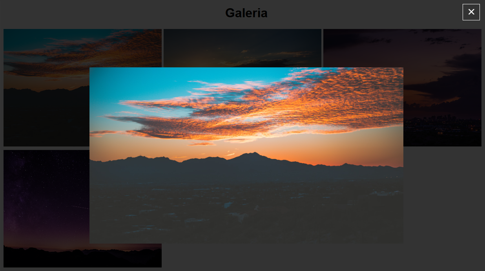

<h1 align="center"> Galeria com Lightbox </h1>

Projeto criado no curso Projetos de JavaScript - 20+ projetos do Hora de Codar.

  <a href="#-tecnologias">Tecnologias</a>&nbsp;&nbsp;&nbsp;|&nbsp;&nbsp;&nbsp;
  <a href="#-projeto">Projeto</a>&nbsp;&nbsp;&nbsp;|&nbsp;&nbsp;&nbsp;
  <a href="#memo-licença">Licença</a>

  

 

  

## 🚀 Tecnologias

Esse projeto foi desenvolvido com as seguintes tecnologias:

- HTML e CSS
- JavaScript
- Git e Github

## 💻 Projeto

O Projeto foi codado no curso de JavaScript do Hora de Codar para treinamento da linguagem.

## :memo: Licença

Esse projeto está sob a licença MIT.

---

Projeto codado e concluído por Leandro Ambrósio!
